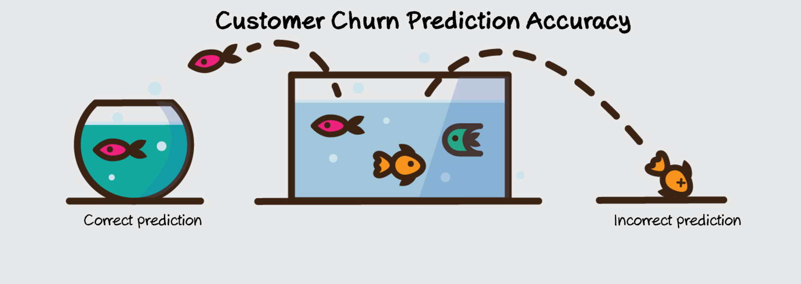

#### Context
"Predict behavior to retain customers. You can analyze all relevant customer data and develop focused customer retention programs." [IBM Sample Data Sets]

#### Content
Each row represents a customer, each column contains customer’s attributes described on the column Metadata.


|Field                                         |Description                               |
|----------------------------------------------|------------------------------------------|
|Churn                                         |customer who left                         |                                 
|Services that each customer has signed up for |phone, multiple lines, internet, online   |
|Services that each customer has signed up for |security, online backup, device           |
|Services that each customer has signed up for |protection,TV tech support, and streaming |


* Demographic info about customers – gender, age range, and if they have partners and dependents




```python

```
